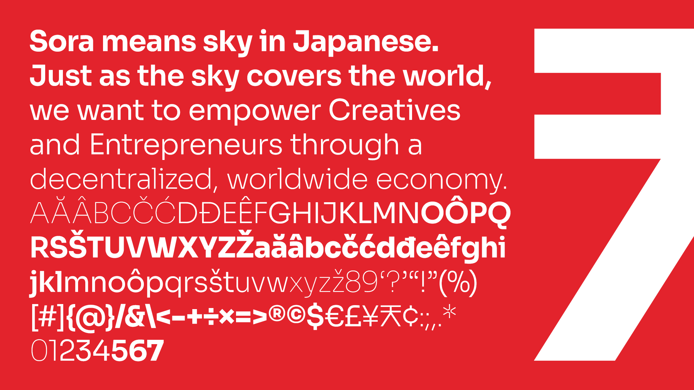

# SORA typeface

SORA is a typeface family commissioned for the [SORA](https://sora.org/) decentralized autonomous economy as a custom solution for branding and interface design. SORAMITSU, the developer of SORA, is a boutique Japanese technology company specializing in developing blockchain technologies and well-known for creating the first central bank digital currency using Hyperledger Iroha for the central bank of Cambodia. SORA, meaning sky in Japanese, is focused on empowering projects that benefit society by delivering new goods and services.

The SORA typeface was designed to capture SORAMITSU's spirit and heritage and is highly optimized for user interfaces. The outcome is a type family with cues of low-resolution aesthetics and early screen typography but without nostalgia, as every decision was considered towards the crisp digital environment of today. The particularly big x-height combined with evidently generous counters turns the family into a convenient tool for app and web interfaces, where clarity and effectiveness at any size is an imperative. Therefore giving us a neutral, yet distinctive, sans serif typeface with excellent legibility across various mediums.

The SORA typeface is an open-source project and available for download and use following the Open Font License (OFL).

### Currently available styles

| Name                 | Weight class
| -------------------- | ----------------
| Thin                 | 100
| Thin Italic          | 100
| ExtraLight           | 200
| ExtraLight Italic    | 200
| Light                | 300
| Light Italic         | 300
| Regular              | 400
| Italic               | 400
| Medium               | 500
| Medium Italic        | 500
| SemiBold             | 600
| SemiBold Italic      | 600
| Bold                 | 700
| Bold Italic          | 700
| ExtraBold            | 800
| ExtraBold Italic     | 800

SORA is also available as a variable font.
